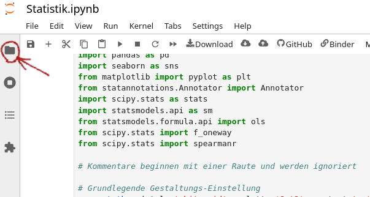
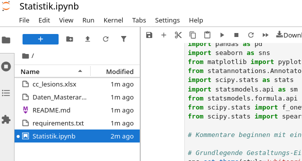
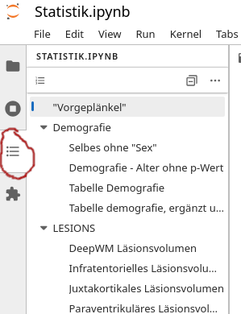

# Earlycogdys MSM - Notebook

## Anleitung zum Arbeiten via mybinder

1. Öffnen mit MyBinder: 
 
 

2. Durch klicken auf das Ordnersymbol kann man den Dateimanager (Sidebar) einblenden

   

  
    In der Datei-Sidebar können Dateien hinzugefügt werden. Entweder per Drag'n'Drop oder mit dem Icon (Pfeil-nach-Oben). 

3. Die Outline zeigt die Struktur des geöffneten Notebooks an, was die Navigation erheblich vereinfacht.

> [!IMPORTANT]
> Dateien müssen zum Speichern immer runtergeladen werden. 

Das System hat keine Berechtiugungen um die Dateien, die ich vorbereitet habe zu verändern. Daher musst Du die Dateien immer selbst auf deinen Rechner runterladen. 
Zum späteren Weiterarbeiten mit deinen eigenen Änderungen kannst du  sie später wieder hochladen.:wq
